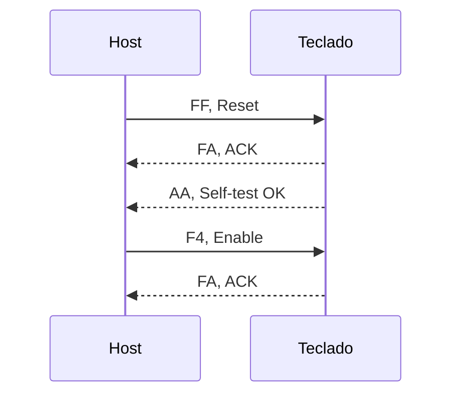

# Controles de la consola

<table align="center">
<tr>
<td align="center">

<table>
<thead>
<tr>
<th>Tecla física</th>
<th>Función</th>
</tr>
</thead>
<tbody>
<tr><td>W</td><td>Arriba</td></tr>
<tr><td>A</td><td>Izquierda</td></tr>
<tr><td>S</td><td>Abajo</td></tr>
<tr><td>D</td><td>Derecha</td></tr>
<tr><td>J</td><td>Botón B</td></tr>
<tr><td>K</td><td>Botón A</td></tr>
<tr><td>Enter</td><td>Start</td></tr>
<tr><td>Espacio</td><td>Select</td></tr>
</tbody>
</table>

</td>
<td align="center">

</td>
</tr>
</table>

## Scan codes

### para el pad numerico

### para el teclado 

| Tecla | Make | Break |
| :---: | :---: | :---: |
| W | `1D` | `F0 1D` |
| A | `1C` | `F0 1C` |
| S | `1B` | `F0 1B` |
| D | `23` | `F0 23` |
| J | `3B` | `F0 3B` |
| K | `42` | `F0 42` |
| Enter | `5A` | `F0 5A` |
| Espacio | `29` | `F0 29` |

## Comandos

### Comandos disponibles para el host

| Comando | Byte | que hace |
| :---: | :--- | :--- |
| Reset | `FF` |  resetea el comando y hace self-test |
| Enable | `F4` | habilita el envio de scancodes al host |

### Comandos disponibles para el teclado

| Comando | Byte | que hace |
| :---: | :--- | :--- |
|  |  |   |
|  |  |  |

### Secuencia de inicializacion

ya despues de esta secuencia de inicio/reset se pueden enviar scancodes

## Funcionamiento

El receptor PS/2 entrega el scan code de cada tecla presionada. El driver del teclado al llegar un make code de una tecla mapeada, se activa el bit del boton correspondiente. Al llegar `F0` seguido de la misma tecla, se desactiva. Mientras una tecla se mantiene presionada, el teclado repite el make code.

