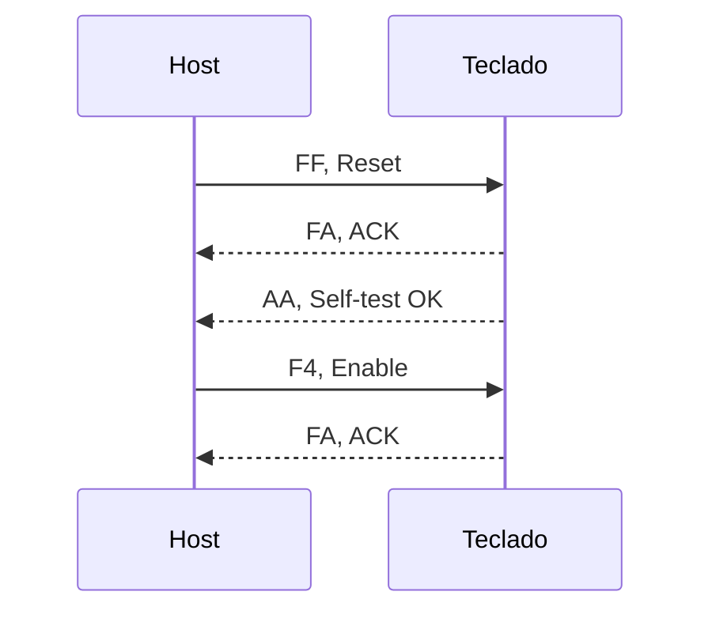

# Controles de la consola

<table align="left">
<tr>
<td align="left" valign="top">
<table>
<thead>
<tr>
<th>Pad numérico</th>
<th>Teclado</th>
<th>Función</th>
</tr>
</thead>
<tbody>
<tr><td>9</td><td>W</td><td>Arriba</td></tr>
<tr><td>.</td><td>A</td><td>Izquierda</td></tr>
<tr><td>3</td><td>S</td><td>Abajo</td></tr>
<tr><td>6</td><td>D</td><td>Derecha</td></tr>
<tr><td>8</td><td>J</td><td>Botón A</td></tr>
<tr><td>F2</td><td>K</td><td>Botón B</td></tr>
<tr><td>Enter</td><td>Enter</td><td>Start</td></tr>
<tr><td>0</td><td>Espacio</td><td>Select</td></tr>
</tbody>
</table>
</td>
<td align="center">
<table align="center">
<tr>
<td align="center">

</td>
<td align="center">

</td>
</tr>
</table>
</td>
</tr>
</table>

## Scan codes

### para el pad numerico
 
| Tecla | Make | Break |
| :---: | :---: | :---: |
| 9 | `7D` | `F0 7D` |
| 6 | `74` | `F0 74` |
| 3 | `7A` | `F0 7A` |
| `.` | `71` | `F0 71` |
| 8 | `75` | `F0 75` |
| F2 | `06` | `F0 06` |
| Enter | `E0 5A` | `E0 F0 5A` |
| 0 | `70` | `F0 70` |
 

### para el teclado 

| Tecla | Make | Break |
| :---: | :---: | :---: |
| W | `1D` | `F0 1D` |
| A | `1C` | `F0 1C` |
| S | `1B` | `F0 1B` |
| D | `23` | `F0 23` |
| J | `3B` | `F0 3B` |
| K | `42` | `F0 42` |
| Enter | `5A` | `F0 5A` |
| Espacio | `29` | `F0 29` |

## Comandos

### Comandos disponibles para el host

| Comando | Byte | que hace |
| :---: | :--- | :--- |
| Reset | `FF` |  resetea el teclado y hace self-test |
| Enable | `F4` | habilita el envio de scancodes al host |
| disable | `F5` | deshabilita el envio de scancodes al host |
| Resend | `FE` | pide el reenvio del ultimo byte enviado del teclado |
| Echo | `EE` | dato de diagnóstico|

### Comandos disponibles para el teclado

| Comando | Byte | que hace |
| :---: | :--- | :--- |
| ACK | `FA` | comfirma que se recibio un comando |
| Self - test | `AA` | comfirma que se paso el self-test |
| Echo | `EE` | Respuesta al comando `EE` |
| Error | `00` / `FF` | Fallo interno |
| Prefijo Extendido | `E0` | se envia antes del codigo de una tecla extendida |
| Break | `FE` | pide el reenvio del ultimo byte enviado del host |
| Resend | `EE` | Respuesta al comando `EE` |

### Secuencia de inicializacion

ya despues de esta secuencia de inicio/reset se pueden enviar scancodes

## Funcionamiento

El receptor PS/2 entrega el scan code de cada tecla presionada. El driver del teclado al llegar un make code de una tecla mapeada, se activa el bit del boton correspondiente. Al llegar `F0` seguido de la misma tecla, se desactiva. Mientras una tecla se mantiene presionada, el teclado repite el make code.
