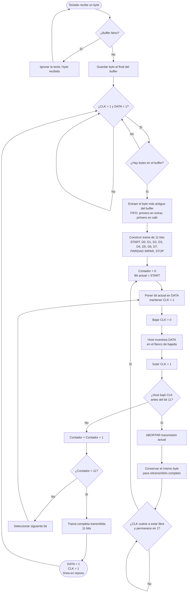
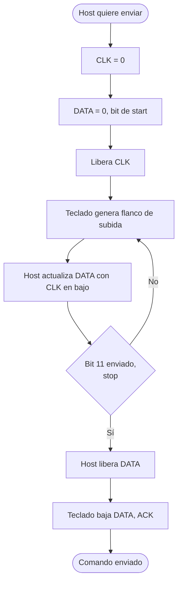

# Diagrama del periférico `Teclado - Host`

```mermaid
flowchart
    A([Teclado recibe un byte]) --> B{¿Buffer lleno?}
    B -- Sí --> C[Ignorar la tecla / byte recibido]
    C --> A
    B -- No --> D[Guardar byte al final del buffer]
    D --> E{¿CLK = 1 y DATA = 1?}
    E -- No --> E
    E -- Sí --> F{¿Hay bytes en el buffer?}
    F -- No --> E
    F -- Sí --> G[Extraer el byte más antiguo del buffer<br/>FIFO: primero en entrar, primero en salir]
    G --> H[Construir trama de 11 bits:<br/>START, D0, D1, D2, D3, D4, D5, D6, D7,<br/>PARIDAD IMPAR, STOP]
    H --> I[Contador = 0<br/>Bit actual = START]
    I --> J[Poner bit actual en DATA<br/>mantener CLK = 1]
    J --> K[Bajar CLK = 0]
    K --> L[Host muestrea DATA<br/>en el flanco de bajada]
    L --> M[Subir CLK = 1]
    M --> N{¿Host bajó CLK<br/>antes del bit 11?}
    N -- Sí --> O[ABORTAR transmisión actual]
    O --> P[Conservar el mismo byte<br/>para retransmitirlo completo]
    P --> Q{¿CLK vuelve a estar libre<br/>y permanece en 1?}
    Q -- No --> Q
    Q -- Sí --> I
    N -- No --> R[Contador = Contador + 1]
    R --> S{¿Contador = 11?}
    S -- No --> T[Seleccionar siguiente bit]
    T --> J
    S -- Sí --> U[Trama completa transmitida<br/>11 bits]
    U --> V([DATA = 1<br/>CLK = 1<br/>línea en reposo])
    V --> E
```

# Diagrama del periférico `Host - Teclado`

```mermaid
flowchart
    A([Host quiere enviar]) --> B[CLK = 0]
    B --> C[DATA = 0, bit de start]
    C --> D[Libera CLK]
    D --> E[Teclado genera flanco de subida]
    E --> F[Host actualiza DATA con CLK en bajo]
    F --> G{Bit 11 enviado,<br/>stop}
    G -- No --> E
    G -- Sí --> H[Host libera DATA]
    H --> I[Teclado baja DATA, ACK]
    I --> J([Comando enviado])
```

